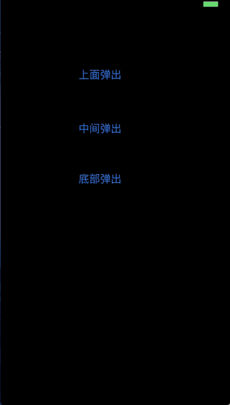

###一个简单强大的弹出视图
#### 效果展示



#### 代码使用

- 视图交互自由选择

````objc
typedef NS_ENUM(NSInteger, WZCSelectViewShowPositionStyle) {
WZCSelectViewShowPositionStyleCenter = 0, //显示在中间
WZCSelectViewShowPositionStyleTop,        //显示在顶端
WZCSelectViewShowPositionStyleBottom      //显示在底部
};


@interface WZCSelectView : UIView

/**
设置动画的时长

@param duration 默认为0.15s
*/
+ (void)setDefaultAnimationDuration:(NSTimeInterval)duration;

/**
点击弹出视图以外的地方 dismiss 视图

@param canDismiss  YES 为启用, NO 为禁用, 默认为 YES
*/
+ (void)setDismissOnTouchOther:(BOOL)canDismiss;


/**
在指定的位置,弹出一个视图,可以在弹出的对象中设置弹出视图的大小(必须设置大小)

@param showVC 要显示的视图控制器
@param positionStyle 显示的位置
*/
+ (void)showViewController:(UIViewController *)showVC position:(WZCSelectViewShowPositionStyle)positionStyle;


+ (void)showView:(UIView *)showView position:(WZCSelectViewShowPositionStyle)positionStyle;

/**
dismiss 当前弹出的视图
*/
+ (void)dismiss;

````


- 一句话调用，不留后遗症

````
UIImage *image = [UIImage imageNamed:@"bgimg.jpg"];
UIImageView *imgV = [[UIImageView alloc] initWithFrame:
CGRectMake(0, 0, self.view.frame.size.width * 0.9, self.view.frame.size.width*0.7)];
imgV.image = image;
imgV.contentMode = UIViewContentModeScaleAspectFill;
imgV.layer.masksToBounds = YES;
//一句话调用，简单实用
[WZCSelectView showView:imgV position:WZCSelectViewShowPositionStyleTop];
````

````
UIViewController *vc = [[UIViewController alloc] init];
vc.view.frame = CGRectMake(0, 0, 330, 300);
vc.view.backgroundColor = [UIColor redColor];
[WZCSelectView showViewController:vc position:WZCSelectViewShowPositionStyleTop];
````
